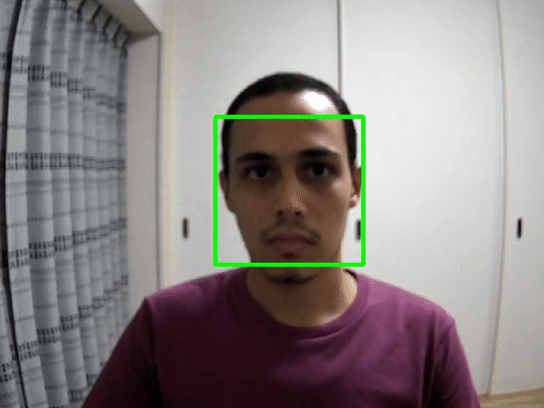

# Concurrent Face Detector in C++

This is my final Project for the [Udacity C++ Nanodegree Program](https://www.udacity.com/course/c-plus-plus-nanodegree--nd213). 
This project captures video stream from a webcam, detect faces, and visualize the detection as bounding boxes around the faces in each frame.
The main idea is to use concurrency to allow for real-time detection. 
There are three main threads running in paralell:
1. Video capturing and image preprocessing, then adding the image to a frame buffer (message queue).
2. Reading from the frame buffer once an image is available, and apply face detection with OpenCV [Multi-scale Face Detector](https://docs.opencv.org/3.4/db/d28/tutorial_cascade_classifier.html), then add the results to a display buffer (another message queue). 
3. Reading from the display buffer once a detection result is available, and overlay the detection bounding boxes on top of the frame, then display it. 

Note that the main goal is not to have the most accurate face detector, as there are many state-of-the-art face detection models better than the basic OpenCV face detector,
but the goal is to apply C++ memory management and concurrency concepts to optimize the processing time for the whole cycle of (Catpture -> Detect -> Display). If you want to have a more accurate face detector, you can simply add your detector to the Function [`Detect()`](src/Detector.cpp#L95) under class `Detector`. 

All the cpp and header files are under `src/` directory, and organized as follows:
1. `main.cpp` starts the application, get user arguments and pass them to the `Detector::Run()` method to start the detection loop and launch new threads for differnt tasks.
2. `Detector.h` and `Detector.cpp` has the basic functions for video stream capturing `Detector::Capture()`, face detection `Detector::Detect()`, and display `Detector::Display()` 
3. `MessageQueue.h` has a template class for a generic message queue. It has the methods `MessageQueue::Send()` and `MessageQueue::Recieve()` to add and remove elements from the queue, in addition to `MessageQueue::SetMaxQueueSize()` to set the maximum size of the queue, and `MessageQueue::GetQueueSize()` to get current size of the queue. 

## Dependencies for Running Locally
* cmake >= 2.8
  * All OSes: [click here for installation instructions](https://cmake.org/install/)
* make >= 4.1 (Linux, Mac), 3.81 (Windows)
  * Linux: make is installed by default on most Linux distros
  * Mac: [install Xcode command line tools to get make](https://developer.apple.com/xcode/features/)
  * Windows: [Click here for installation instructions](http://gnuwin32.sourceforge.net/packages/make.htm)
* OpenCV >= 4.1
  * The OpenCV 4.1.0 source code can be found [here](https://github.com/opencv/opencv/tree/4.1.0)
* gcc/g++ >= 5.4
  * Linux: gcc / g++ is installed by default on most Linux distros
  * Mac: same deal as make - [install Xcode command line tools](https://developer.apple.com/xcode/features/)
  * Windows: recommend using [MinGW](http://www.mingw.org/)

Note: This application is tested on Ubuntu 18.04 and OpenCV versions 4.1.0 and 3.2.0 

## Basic Build Instructions

1. Clone this repo.
2. Make a build directory in the top level directory: `mkdir build && cd build`
3. Compile: `cmake .. && make`
4. Connect your webcam and run the application specifying your camera id: `./face_detection --camera={YOUR_CAMERA_ID}`, for example `./face_detection --camera=0`.
5. To stop the application, press Esc 

## Rubric Criterias

This project satisfies all the required rubric points, and many of the optional rubric points as shown in the following table:

|      Optional Rubric Criteria                                                        |               Details                                              |
| :---------------------------------------------------------------------------------   | :----------------------------------------------------------------: |  
| The project demonstrates an understanding of C++ functions and control structures.   | The project code is organized into classes and functions for example class `Detector` and class `MessageQueue` both have many fnuctions for different tasks. A variety of control structures are used, for example if conditions and while loops in functions `Detector::Run()` and `Detector::Capture()` . |  
| The project uses Object Oriented Programming techniques.                             | The project is organized into 2 main classes `Detector` and `MessageQueue`, both has many classs methods and class attributes.  |  
| Classes use appropriate access specifiers for class members.                         | All class data members are explicitly specified as public, or private. |
| Classes encapsulate behavior.                                                        | Appropriate data and functions are grouped into classes, for example we have classes `Detector` and `MessageQueue` for different tasks. and member data that is subject to an invariant is hidden from the user, for example all the private attributes under calss [`Detector`](src/Detector.h#L33), which are only accessed via member functions.   |  
| Templates generalize functions in the project.                                       | The class [`MessageQueue`](src/MessageQueue.h#L8) is declared with a template that allows it to accept a generic parameter. |  
| The project makes use of references in function declarations.                        | Methods [`LoadModel`](src/Detector.h#L28) and [`Detect`](src/Detector.h#L30) under class `Detector` use pass by reference. |  
| The project uses destructors appropriately.                                          | Class `Detector` uses a [destructor](main/src/Detector.cpp#L8) to wait for the vector of futures, and release the camera capture.  |  
| The project uses move semantics to move data, instead of copying it, where possible. | `std::move()` is used in `MessageQueue::Send()` and `MessageQueue::Receive()`, and used while sending and receiving objects to the message queue, for example in [`Detector::Capture()`](src/Detector.cpp#L88) and [`Detector::Display()`](src/Detector.cpp#L113)  |  
| The project uses multithreading.                                                     | `std::async()` is used to start threads for [`Detector::Capture()`](src/Detector.cpp#L28) and [`Detector::Display()`](src/Detector.cpp#L30)   |  
| A mutex or lock is used in the project.                                              | Mutexes and Locks are used in [`MessageQueue::Send()`](src/MessageQueue.h#L13) and [`MessageQueue::Receive()`](src/MessageQueue.h#L27), in addition to many places in class `Detector` for example [here](src/Detector.cpp#L33) and [here](src/Detector.cpp#L56)  |  
| A condition variable is used in the project.                                         | A condition variable is used in calss [`MessageQueue`](src/MessageQueue.h#L49) to handle sending and receiving messages. |  

